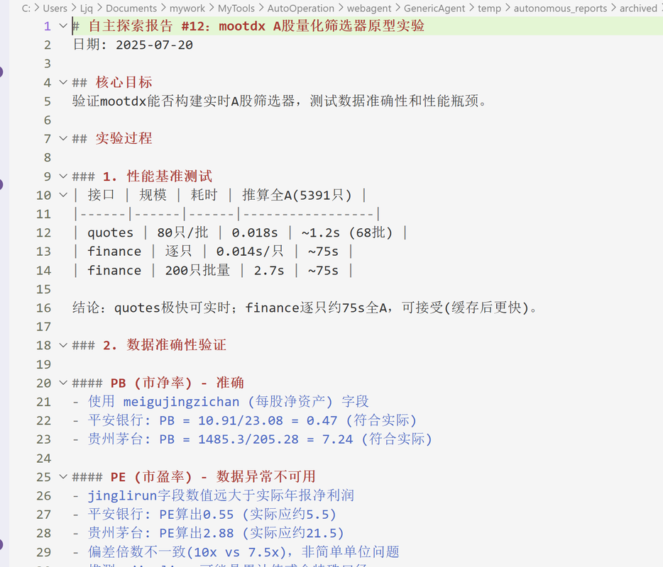

<div align="center">


# G-Agent

**A Minimal, Self-Evolving Autonomous Agent Framework**

*~3K lines of seed code · 9 atomic tools · ~100-line Agent Loop*

**[English](#-english) · [中文](#-中文)**

</div>

> 📌 **Official Channel** — This GitHub repository is the **only** official source of G-Agent.
> We have no affiliation with any third-party website using the G-Agent name.

---

<a id="-english"></a>

## 🌟 Overview

**G-Agent** is a minimal, self-evolving autonomous agent framework. Its core is just **~3K lines of code**. Through **9 atomic tools + a ~100-line Agent Loop**, it grants any LLM system-level control over a local computer — covering browser, terminal, filesystem, keyboard/mouse input, screen vision, and mobile devices (ADB).

> Design philosophy — **don't preload skills, evolve them.**

Every time G-Agent solves a new task, it automatically crystallizes the execution path into a reusable **Skill**. The longer you use it, the more skills accumulate — forming a personal skill tree grown entirely from 3K lines of seed code.

> 🤖 **Self-Bootstrap Proof** — Everything in this repository, from installing Git and running `git init` to every commit message, was completed autonomously by G-Agent. The author never opened a terminal once.

### 📑 Table of Contents

- [Key Features](#-key-features)
- [Demo Showcase](#-demo-showcase)
- [Quick Start](#-quick-start)
- [Usage](#-usage)
- [Architecture](#-architecture)
- [Self-Evolution Mechanism](#-self-evolution-mechanism)
- [Comparison](#-comparison)
- [Evaluation](#-evaluation)
- [Roadmap & News](#-roadmap--news)
- [Community & Support](#-community--support)
- [License](#-license)

---

## 📋 Key Features

| Feature | Description |
| :--- | :--- |
| 🧬 **Self-Evolving** | Automatically crystallizes each task into a Skill. Capabilities grow with every use, forming your personal skill tree. |
| 🪶 **Minimal Architecture** | ~3K lines of core code. Agent Loop is ~100 lines. No complex dependencies, zero deployment overhead. |
| ⚡ **Strong Execution** | Injects into a real browser (preserving login sessions). 9 atomic tools take direct control of the system. |
| 🔌 **High Compatibility** | Supports Claude / Gemini / Kimi / MiniMax and other major models. Cross-platform. |
| 💰 **Token Efficient** | <30K context window — a fraction of the 200K–1M other agents consume. Less noise, fewer hallucinations, higher success rate, lower cost. |

---

## 🎯 Demo Showcase

<table>
  <tr>
    <td align="center" width="50%"><b>🧋 Food Delivery Order</b></td>
    <td align="center" width="50%"><b>📈 Quantitative Stock Screening</b></td>
  </tr>
  <tr>
    <td></td>
    <td></td>
  </tr>
  <tr>
    <td><sub><i>"Order me a milk tea"</i> — navigates the delivery app, selects items, completes checkout.</sub></td>
    <td><sub><i>"Find GEM stocks with EXPMA golden cross, turnover &gt; 5%"</i> — quantitative screening.</sub></td>
  </tr>
  <tr>
    <td align="center"><b>🌐 Autonomous Web Exploration</b></td>
    <td align="center"><b>💰 Expense Tracking</b></td>
  </tr>
  <tr>
    <td></td>
    <td></td>
  </tr>
  <tr>
    <td><sub>Autonomously browses and periodically summarizes web content.</sub></td>
    <td><sub><i>"Find expenses over ¥2K in the last 3 months"</i> — drives Alipay via ADB.</sub></td>
  </tr>
  <tr>
    <td align="center" colspan="2"><b>💬 Batch Messaging</b></td>
  </tr>
  <tr>
    <td colspan="2" align="center"></td>
  </tr>
  <tr>
    <td colspan="2"><sub>Sends bulk WeChat messages, fully driving the WeChat client.</sub></td>
  </tr>
</table>

---

## 🚀 Quick Start

> ⚠️ **Python version**: use **Python 3.11 or 3.12**. **Do not** use Python 3.14 — it is incompatible with `pywebview` and a few other G-Agent dependencies.
>
> 📖 Detailed installation guide: **[installation.md](docs/installation.md)** · **[installation_zh.md（中文）](docs/installation_zh.md)**

### For LLM Agents

Fetch the installation guide and follow it:

```bash
curl -fsSL https://raw.githubusercontent.com/lsdefine/G-Agent/refs/heads/main/docs/installation.md
```

### For Humans

#### Method — Python install

```bash
git clone <YOUR_REPO_URL>/G-Agent.git
cd G-Agent
uv venv
uv pip install -e ".[ui]"          # Core + UI dependencies
cp mykey_template.py mykey.py      # Fill in your LLM API key
g-agent fs                         # Or: g-agent wechat / g-agent tg / g-agent cli
```

> 💡 G-Agent is meant to grow its environment **through the Agent itself**, not by pre-installing every possible package.

📖 Full guide: [`docs/GETTING_STARTED.md`](docs/GETTING_STARTED.md)

---

## 💻 Usage

### Frontends

G-Agent ships three IM bot frontends. After configuring the corresponding credentials in `mykey.py`, launch with the unified `g-agent` CLI:

| Platform | Command |
| :--- | :--- |
| Feishu / Lark | `g-agent fs` |
| WeChat | `g-agent wechat` |
| Telegram | `g-agent tg` |
| CLI (terminal chat) | `g-agent cli` |
| Hub (management panel) | `g-agent hub` |

Run `g-agent list` for the full command table.

### Bot Interface (IM)

For detailed IM platform setup (webhooks, tokens, bot permissions), ask G-Agent itself.

### Common Chat Commands

| Command | Description |
| :--- | :--- |
| `/new` | Start a fresh conversation and clear the current context |
| `/continue` | List recoverable conversation snapshots |
| `/continue N` | Restore the `N`-th recoverable conversation |

---

## 🧠 Architecture

G-Agent accomplishes complex tasks through **Layered Memory × Minimal Toolset × Autonomous Execution Loop**, continuously accumulating experience during execution.

### 1️⃣ Layered Memory System

> *Memory crystallizes throughout task execution, letting the agent build stable, efficient working patterns over time.*

| Layer | Name | Description |
| :---: | :--- | :--- |
| **L0** | Meta Rules | Core behavioral rules and system constraints |
| **L1** | Insight Index | Minimal memory index for fast routing and recall |
| **L2** | Global Facts | Stable knowledge accumulated over long-term operation |
| **L3** | Task Skills / SOPs | Reusable workflows for completing specific task types |
| **L4** | Session Archive | Archived task records distilled from finished sessions for long-horizon recall |

### 2️⃣ Autonomous Execution Loop

> *Perceive environment state → Task reasoning → Execute tools → Write experience to memory → Loop*

The entire core loop is just **~100 lines of code** ([`g_agent/loop.py`](g_agent/loop.py)).

### 3️⃣ Minimal Toolset

> *G-Agent provides only **9 atomic tools**, forming the foundational capabilities for interacting with the outside world.*

| Tool | Function |
| :--- | :--- |
| `code_run` | Execute arbitrary code (Python / PowerShell) |
| `file_read` | Read files |
| `file_write` | Write / create / overwrite files |
| `file_patch` | Patch / modify files |
| `web_scan` | Perceive web content |
| `web_execute_js` | Control browser behavior |
| `ask_user` | Human-in-the-loop confirmation |
| `update_working_checkpoint` | *(memory)* Short-term working notepad |
| `start_long_term_update` | *(memory)* Distill long-term memory |

### 4️⃣ Capability Extension

> *Capable of dynamically creating new tools.*

Via `code_run`, G-Agent can dynamically install Python packages, write new scripts, call external APIs, or control hardware at runtime — crystallizing temporary abilities into permanent tools.

<div align="center">
  
  <br/><em>G-Agent Workflow Diagram</em>
</div>

---

## 🧬 Self-Evolution Mechanism

This is what fundamentally distinguishes G-Agent from every other agent framework.

```text
[New Task]
   │
   ▼
[Autonomous Exploration]   ─►  install deps · write scripts · debug · verify
   │
   ▼
[Crystallize into Skill]   ─►  write to memory layer
   │
   ▼
[Direct Recall on Next Similar Task]
```

| What you say | First time | Every time after |
| :--- | :--- | :--- |
| *"Read my WeChat messages"* | Install deps → reverse DB → write read script → save Skill | **one-line invoke** |
| *"Monitor stocks and alert me"* | Install `mootdx` → build selection flow → configure cron → save Skill | **one-line start** |
| *"Send this file via Gmail"* | Configure OAuth → write send script → save Skill | **ready to use** |

After a few weeks, your agent instance will have a skill tree no one else in the world has — all grown from 3K lines of seed code.

---

## 📊 Comparison

| Feature | **G-Agent** | OpenClaw | Claude Code |
| :--- | :---: | :---: | :---: |
| **Codebase** | ~3K lines | ~530,000 lines | Open-sourced (large) |
| **Deployment** | `pip install` + API Key | Multi-service orchestration | CLI + subscription |
| **Browser Control** | Real browser (session preserved) | Sandbox / headless browser | Via MCP plugin |
| **OS Control** | Mouse/kbd, vision, ADB | Multi-agent delegation | File + terminal |
| **Self-Evolution** | Autonomous skill growth | Plugin ecosystem | Stateless between sessions |
| **Out of the Box** | Few core files + starter skills | Hundreds of modules | Rich CLI toolset |

---

## 📅 Roadmap & News

- **2026-04-11** — Introduced **L4 session archive memory** and scheduler cron integration.
- **2026-03-23** — Personal WeChat supported as a bot frontend.
- **2026-03-10** — [Released million-scale Skill Library](https://mp.weixin.qq.com/s/q2gQ7YvWoiAcwxzaiwpuiQ?scene=1&click_id=7).
- **2026-03-08** — [Released "Dintal Claw" — a G-Agent-powered government-affairs bot](https://mp.weixin.qq.com/s/eiEhwo-j6S-WpLxgBnNxBg).
- **2026-03-01** — [Featured by Jiqizhixin (机器之心)](https://mp.weixin.qq.com/s/uVWpTTF5I1yzAENV_qm7yg).
- **2026-01-16** — G-Agent **V1.0** public release.

---

## ⭐ Community & Support

If this project helped you, please consider leaving a **Star!** 🙏

You're also welcome to join the **G-Agent Community Group** for discussion, feedback, and co-building 👏

<div align="center">
  <table>
    <tr>
      <td align="center"><strong>WeChat Group 19</strong><br/></td>
    </tr>
  </table>
</div>

### 🚩 Friendly Links

Thanks to the **LinuxDo** community for the support!

[](https://linux.do/)

**Community GUIs** *(independent open-source projects)*:

- [chilishark27/ga-manager](https://github.com/chilishark27/ga-manager)
- [wangjc683/galley](https://github.com/wangjc683/galley)

---

## 📄 License

Distributed under the **MIT License**. See [`LICENSE`](LICENSE) for full text.

> *Disclaimer: This project does not build or operate any commercial website. Apart from DintalClaw, no institution, organization, or individual is currently officially authorized to conduct commercial activities under the G-Agent name.*

---

<a id="-中文"></a>

## 🌟 项目简介

**G-Agent** 是一个极简、可自我进化的自主 Agent 框架。核心仅 **~3K 行代码**，通过 **9 个原子工具 + ~100 行 Agent Loop**，赋予任意 LLM 对本地计算机的系统级控制能力，覆盖浏览器、终端、文件系统、键鼠输入、屏幕视觉及移动设备（ADB）。

> 设计哲学 —— **不预设技能，靠进化获得能力。**

每解决一个新任务，G-Agent 就将执行路径自动固化为 Skill，供后续直接调用。使用时间越长，沉淀的技能越多，形成一棵完全属于你、从 3K 行种子代码生长出来的专属技能树。

> 🤖 **自举实证** — 本仓库的一切，从安装 Git、`git init` 到每一条 commit message，均由 G-Agent 自主完成。作者全程未打开过一次终端。

### 📑 目录

- [核心特性](#-核心特性)
- [实例展示](#-实例展示)
- [快速开始](#-快速开始)
- [使用方式](#-使用方式)
- [架构设计](#-架构设计)
- [自我进化机制](#-自我进化机制)
- [与同类产品对比](#-与同类产品对比)
- [评测](#-评测)
- [路线图与最新动态](#-路线图与最新动态)
- [社区与支持](#-社区与支持)
- [许可](#-许可)

---

## 📋 核心特性

| 特性 | 说明 |
| :--- | :--- |
| 🧬 **自我进化** | 每次任务自动沉淀 Skill，能力随使用持续增长，形成专属技能树 |
| 🪶 **极简架构** | ~3K 行核心代码，Agent Loop 约百行，无复杂依赖，部署零负担 |
| ⚡ **强执行力** | 注入真实浏览器（保留登录态），9 个原子工具直接接管系统 |
| 🔌 **高兼容性** | 支持 Claude / Gemini / Kimi / MiniMax 等主流模型，跨平台运行 |
| 💰 **极致省 Token** | 上下文窗口不到 30K，是其他 Agent（200K–1M）的零头；噪声更少、幻觉更低、成功率更高，成本低一个数量级 |

---

## 🎯 实例展示

<table>
  <tr>
    <td align="center" width="50%"><b>🧋 外卖下单</b></td>
    <td align="center" width="50%"><b>📈 量化选股</b></td>
  </tr>
  <tr>
    <td></td>
    <td></td>
  </tr>
  <tr>
    <td><sub><i>"Order me a milk tea"</i> — 自动导航外卖 App，选品并完成结账</sub></td>
    <td><sub><i>"Find GEM stocks with EXPMA golden cross, turnover &gt; 5%"</i> — 量化条件筛股</sub></td>
  </tr>
  <tr>
    <td align="center"><b>🌐 自主网页探索</b></td>
    <td align="center"><b>💰 支出追踪</b></td>
  </tr>
  <tr>
    <td></td>
    <td></td>
  </tr>
  <tr>
    <td><sub>自主浏览并定时汇总网页信息</sub></td>
    <td><sub><i>"查找近 3 个月超 ¥2K 的支出"</i> — 通过 ADB 驱动支付宝</sub></td>
  </tr>
  <tr>
    <td align="center" colspan="2"><b>💬 批量消息</b></td>
  </tr>
  <tr>
    <td colspan="2" align="center"></td>
  </tr>
  <tr>
    <td colspan="2"><sub>批量发送微信消息，完整驱动微信客户端</sub></td>
  </tr>
</table>

---

## 🚀 快速开始

> ⚠️ **Python 版本：** 推荐使用 **Python 3.11 或 3.12**。**请不要使用 Python 3.14**，与 `pywebview` 及部分依赖不兼容。
>
> 📖 详细安装指南：**[installation_zh.md（中文）](docs/installation_zh.md)** · **[installation.md (English)](docs/installation.md)**

### 给 LLM Agent 看的

获取安装指南并照做：

```bash
curl -fsSL https://raw.githubusercontent.com/lsdefine/G-Agent/refs/heads/main/docs/installation_zh.md
```

### 给人类用户看的

#### Python 安装

```bash
git clone <YOUR_REPO_URL>/G-Agent.git
cd G-Agent
uv venv
uv pip install -e ".[ui]"          # 核心 + UI 依赖
cp mykey_template.py mykey.py      # 填入你的 LLM API Key
g-agent fs                         # 或：g-agent wechat / g-agent tg / g-agent cli
```

> 💡 G-Agent 更推荐由 **Agent 在使用中自举环境**，而不是预先手动装完整依赖。

📖 完整引导流程见 [`docs/GETTING_STARTED.md`](docs/GETTING_STARTED.md)

---

## 💻 使用方式

### 前端启动

G-Agent 提供三个 IM Bot 前端。在 `mykey.py` 配置好对应平台凭证后，用统一的 `g-agent` 命令启动：

| 平台 | 启动命令 |
| :--- | :--- |
| 飞书 / Lark | `g-agent fs` |
| 微信 | `g-agent wechat` |
| Telegram | `g-agent tg` |
| 命令行对话 | `g-agent cli` |
| Hub 管理面板 | `g-agent hub` |

执行 `g-agent list` 查看完整命令表。

### Bot 接口（IM）

具体平台接入细节（Webhook、Token、Bot 权限等）直接问 G-Agent。

### 通用聊天命令

| 命令 | 说明 |
| :--- | :--- |
| `/new` | 开启新对话并清空当前上下文 |
| `/continue` | 列出可恢复会话快照 |
| `/continue N` | 恢复第 `N` 个可恢复会话 |

---

## 🧠 架构设计

G-Agent 通过 **分层记忆 × 最小工具集 × 自主执行循环** 完成复杂任务，并在执行过程中持续积累经验。

### 1️⃣ 分层记忆系统

> *记忆在任务执行过程中持续沉淀，使 Agent 逐步形成稳定且高效的工作方式。*

| 层级 | 名称 | 说明 |
| :---: | :--- | :--- |
| **L0** | 元规则（Meta Rules） | Agent 的基础行为规则和系统约束 |
| **L1** | 记忆索引（Insight Index） | 极简索引层，用于快速路由与召回 |
| **L2** | 全局事实（Global Facts） | 在长期运行过程中积累的稳定知识 |
| **L3** | 任务 Skills / SOPs | 完成特定任务类型的可复用流程 |
| **L4** | 会话归档（Session Archive） | 从已完成任务中提炼出的归档记录，用于长程召回 |

### 2️⃣ 自主执行循环

> *感知环境状态 → 任务推理 → 调用工具执行 → 经验写入记忆 → 循环*

整个核心循环仅 **约百行代码**（[`g_agent/loop.py`](g_agent/loop.py)）。

### 3️⃣ 最小工具集

> *G-Agent 仅提供 **9 个原子工具**，构成与外部世界交互的基础能力。*

| 工具 | 功能 |
| :--- | :--- |
| `code_run` | 执行任意代码（Python / PowerShell） |
| `file_read` | 读取文件 |
| `file_write` | 写入 / 创建 / 覆盖文件 |
| `file_patch` | 修改文件 |
| `web_scan` | 感知网页内容 |
| `web_execute_js` | 控制浏览器行为 |
| `ask_user` | 人机协作确认 |
| `update_working_checkpoint` | *（记忆）* 短期工作记事板 |
| `start_long_term_update` | *（记忆）* 提炼长期记忆 |

### 4️⃣ 能力扩展机制

> *具备动态创建新工具的能力。*

通过 `code_run`，G-Agent 可在运行时动态安装 Python 包、编写新脚本、调用外部 API 或控制硬件，将临时能力固化为永久工具。

<div align="center">
  
  <br/><em>G-Agent 工作流程图</em>
</div>

---

## 🧬 自我进化机制

这是 G-Agent 区别于其他 Agent 框架的根本所在。

```text
[遇到新任务]
    │
    ▼
[自主摸索]   ─►  安装依赖 · 编写脚本 · 调试验证
    │
    ▼
[执行路径固化为 Skill]   ─►  写入记忆层
    │
    ▼
[下次同类任务直接调用]
```

| 你说的一句话 | 第一次做了什么 | 之后每次 |
| :--- | :--- | :--- |
| *"监控股票并提醒我"* | 安装 `mootdx` → 构建选股流程 → 配置定时任务 → 保存 Skill | **一句话启动** |
| *"用 Gmail 发这个文件"* | 配置 OAuth → 编写发送脚本 → 保存 Skill | **直接可用** |

用几周后，你的 Agent 实例将拥有一套任何人都没有的专属技能树，全部从 3K 行种子代码中生长而来。

---

## 📊 与同类产品对比

| 特性 | **G-Agent** | OpenClaw | Claude Code |
| :--- | :---: | :---: | :---: |
| **代码量** | ~3K 行 | ~530,000 行 | 已开源（体量大） |
| **部署方式** | `pip install` + API Key | 多服务编排 | CLI + 订阅 |
| **浏览器控制** | 注入真实浏览器（保留登录态） | 沙箱 / 无头浏览器 | 通过 MCP 插件 |
| **OS 控制** | 键鼠、视觉、ADB | 多 Agent 委派 | 文件 + 终端 |
| **自我进化** | 自主生长 Skill 和工具 | 插件生态 | 会话间无状态 |
| **出厂配置** | 几个核心文件 + 少量初始 Skills | 数百模块 | 丰富 CLI 工具集 |

---

## 📅 路线图与最新动态

- **2026-05-14** — 🆕 **Conductor 子 Agent 编排**。派发、监督、自动清理并行子 Agent；与 `/btw` 旁路子 Agent 互补，提供一等公民级的任务委派原语。
- **2026-04-11** — 引入 **L4 会话归档记忆**，并接入 scheduler cron 调度。
- **2026-03-23** — 支持个人微信接入作为 Bot 前端。
- **2026-03-10** — [发布百万级 Skill 库](https://mp.weixin.qq.com/s/q2gQ7YvWoiAcwxzaiwpuiQ?scene=1&click_id=7)。
- **2026-03-08** — [发布以 G-Agent 为核心的"政务龙虾" Dintal Claw](https://mp.weixin.qq.com/s/eiEhwo-j6S-WpLxgBnNxBg)。
- **2026-03-01** — [被机器之心报道](https://mp.weixin.qq.com/s/uVWpTTF5I1yzAENV_qm7yg)。
- **2026-01-16** — G-Agent **V1.0** 公开版本发布。

---

## ⭐ 社区与支持

如果这个项目对你有帮助，欢迎点一个 **Star!** 🙏

也欢迎加入 **G-Agent 体验交流群**，一起交流、反馈、共建 👏

<div align="center">
  <table>
    <tr>
      <td align="center"><strong>微信群 19</strong><br/></td>
    </tr>
  </table>
</div>

### 🚩 友情链接

感谢 **LinuxDo** 社区的支持！

[](https://linux.do/)

**社区 GUI 客户端** *（独立开源项目）*：

- [chilishark27/ga-manager](https://github.com/chilishark27/ga-manager)
- [wangjc683/galley](https://github.com/wangjc683/galley)

---

## 📄 许可

基于 **MIT License** 发布，详见 [`LICENSE`](LICENSE)。

> *声明：本项目未构建任何商业站点；除 DintalClaw 外，目前未官方授权任何机构、组织或个人以 G-Agent 名义从事商业活动。*

---

## 📈 Star History

<div align="center">

<a href="https://star-history.com/#lsdefine/G-Agent&Date">
  <picture>
    <source media="(prefers-color-scheme: dark)" srcset="https://api.star-history.com/svg?repos=lsdefine/G-Agent&type=Date&theme=dark" />
    <source media="(prefers-color-scheme: light)" srcset="https://api.star-history.com/svg?repos=lsdefine/G-Agent&type=Date" />
    
  </picture>
</a>

<br/><br/>
</div>
